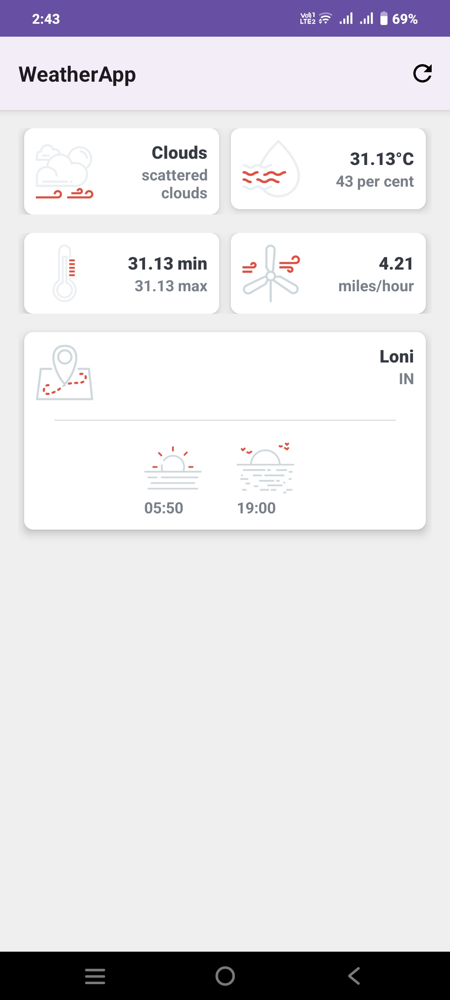
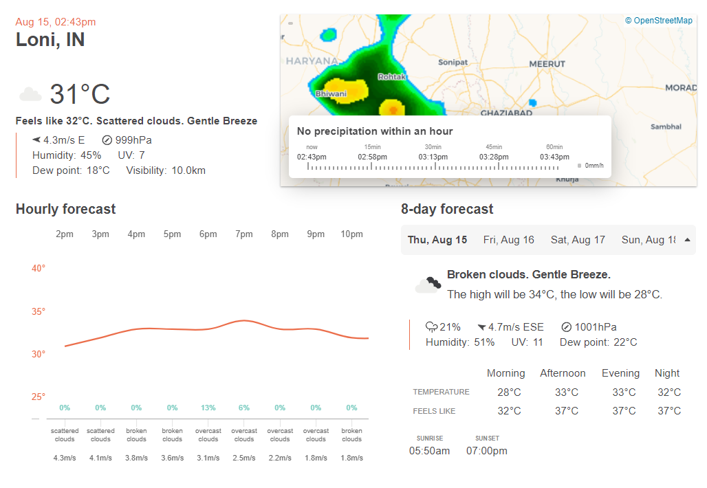

# WeatherApp

WeatherApp is an Android application that provides real-time weather information based on the user's current location. The app fetches data from a weather API using Retrofit and displays it in a user-friendly interface. 

## Features

- **Real-time Weather Data**: Displays the current weather conditions, including temperature, humidity, wind speed, and more.
- **Location-based Updates**: Automatically fetches weather data based on the user's current location using the Fused Location Provider.
- **Permission Handling**: Uses Dexter for smooth permission management.
- **Offline Storage**: Saves the last fetched weather data locally using SharedPreferences.
- **Custom UI**: Displays weather icons and details with a clean and intuitive user interface.

## Screenshots




## Installation

1. Clone the repository:

   ```bash
   git clone https://github.com/yuvrajSingh627/WeatherApp.git
